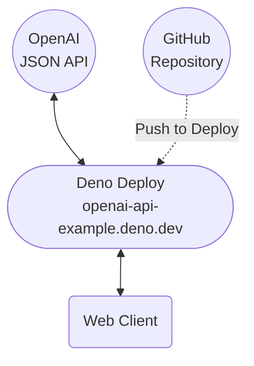

# **OpenAI API Example**

Example of generative AI service using OpenAI API.

# Diagram

```mermaid
flowchart TD

A(("OpenAI\nJSON API"))
B(("GitHub\nRepository"))
C(["Deno Deploy\nopenai-api-example.deno.dev"])

A <--> C
B -."Push to Deploy".-> C

C <--> D("Web Client")
```